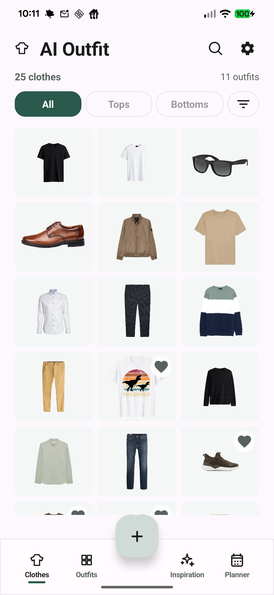
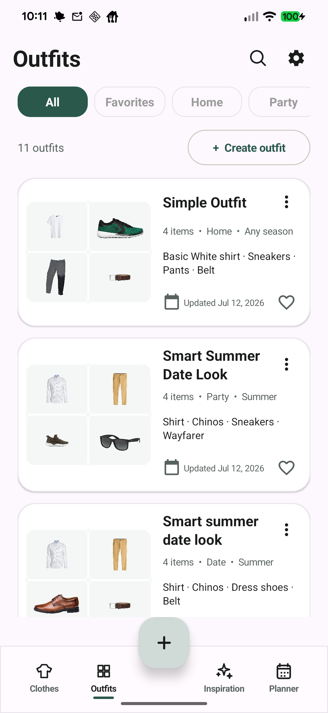
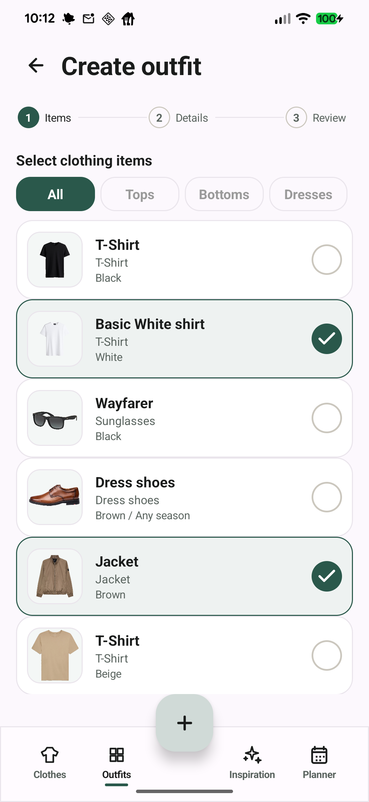
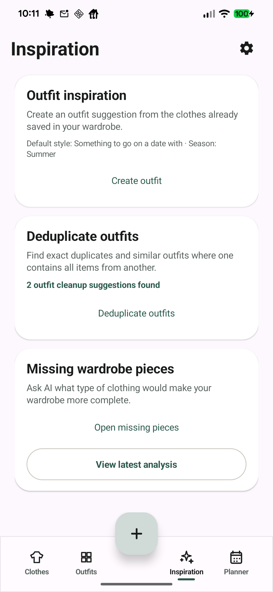
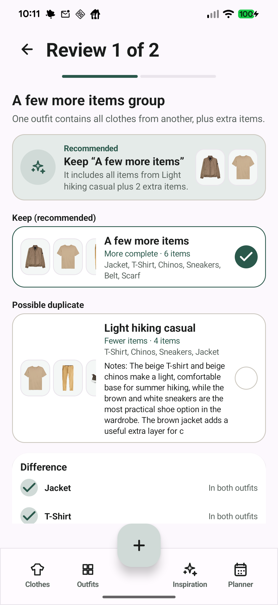
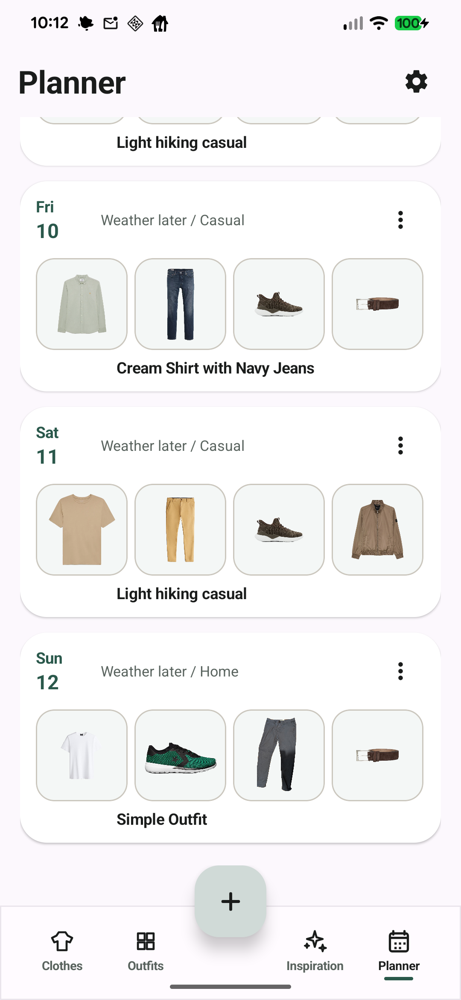

# AI Outfit

AI Outfit is a native Android wardrobe app for cataloging clothes, maintaining rich item metadata, building outfits, planning what to wear, and using optional AI assistance for inspiration and wardrobe analysis.

The app is built as a local-first Android project. Wardrobe data is stored on-device with JSON-backed `SharedPreferences`, and photos are referenced or copied into app-private storage depending on the workflow.

## Screenshots

| Clothes | Outfits | Create outfit |
| --- | --- | --- |
|  |  |  |

| Inspiration | Duplicate review | Planner |
| --- | --- | --- |
|  |  |  |

## Current Features

### Wardrobe Inventory

- Clothing overview with a Material-style grid, category filters, detailed filter entry, search, and favorites.
- Clothing details with editable category, name, brand, color, material percentages, damage, notes, links, fit/size, waist, length, added date, season, price, and care instructions.
- Multiple photos per clothing item, including photo swiping and manual photo ordering.
- Favorite clothes with heart indicators and filtering.
- Personal size settings for shirts, pants, and shoes, with fit warnings when an item appears smaller or larger than the saved size.
- Category picker with grouped clothing categories, including accessories such as sunglasses and watches, plus custom categories.

### Photo Tools

- Add, replace, rotate, crop, zoom, and reorder clothing photos.
- Background removal with Google ML Kit subject segmentation.
- Manual mask editor for refining transparent-background cutouts with remove/restore brush modes.
- Transparent clothing images are shown without forcing a white background in the overview.

### Outfit Builder

- Three-step outfit creation and editing flow: select items, enter details, review.
- Category filters and selectable clothing rows with thumbnails, metadata, favorite state, and selection indicators.
- Outfit metadata for name, occasion, season, and notes.
- Outfit overview cards with thumbnails, item names, occasion, season, update date, favorite state, and overflow actions.
- Outfit detail view with adaptive collage/gallery, item list, edit, duplicate, planner, share, and delete actions.
- Outfit infographic sharing: generates a local 1080 x 1350 PNG image from outfit metadata and clothing photos, then opens the Android share sheet.

### Planner

- Dedicated Planner tab for assigning outfits to days.
- Week and month planning views.
- Day cards with outfit previews, occasion, placeholder weather context, and actions.
- Day detail view with planned outfit preview, notes, and worn/unworn state.
- Add an existing outfit to a selected day or build an outfit from the planner flow.
- Warning when adding an outfit to a day that already has a planned outfit.

### Inspiration And AI

- Dedicated Inspiration tab.
- Optional OpenAI-compatible outfit inspiration using the saved wardrobe, current season, selected occasion, and user style prompt.
- Missing wardrobe pieces analysis with saved latest result.
- Duplicate outfit cleanup, including exact duplicates and subset/similar outfit review.
- AI profile settings for gender, hair color, eye color, full-body photo, face photo, style preference, OpenAI API key, base URL, and model.
- Default OpenAI base URL: `https://eu.api.openai.com/v1`.

### Settings And Backup

- Settings for primary color, currency, units/language placeholders, personal sizes, custom categories, and app/about information.
- Full wardrobe export/import as a `.aioutfitbackup` ZIP:
  - clothes
  - outfits
  - planner entries
  - categories
  - currency
  - primary color
  - personal sizes
  - latest wardrobe gap analysis
  - clothing photos
- Import replaces the current wardrobe to avoid duplicate data and broken outfit references.

## Tech Stack

- Native Android, Java
- Android Gradle Plugin `8.8.1`
- Gradle Wrapper `8.10.2`
- Compile SDK `35`, min SDK `26`
- Google ML Kit Subject Segmentation
- AndroidX Core `FileProvider` for sharing generated outfit PNGs

## Build

Open the project in Android Studio, or build from the command line with the bundled Gradle wrapper:

```sh
./gradlew assembleDebug
```

If your shell is still using an older Java runtime, point Gradle at Android Studio's bundled JBR:

```sh
JAVA_HOME="/Applications/Android Studio.app/Contents/jbr/Contents/Home" \
ANDROID_HOME="$HOME/Library/Android/sdk" \
PATH="/Applications/Android Studio.app/Contents/jbr/Contents/Home/bin:$ANDROID_HOME/platform-tools:$PATH" \
./gradlew assembleDebug
```

The debug APK is produced at:

```text
app/build/outputs/apk/debug/app-debug.apk
```

## Privacy Notes

- Core wardrobe features are local-first.
- AI features are optional and require the user to configure an API key.
- When AI features are used, wardrobe metadata and the relevant prompt context may be sent to the configured OpenAI-compatible endpoint.
